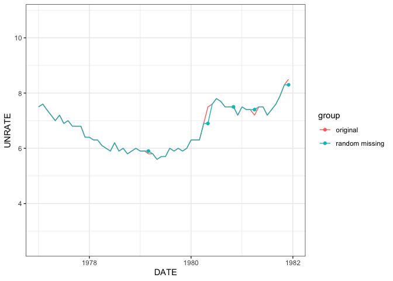
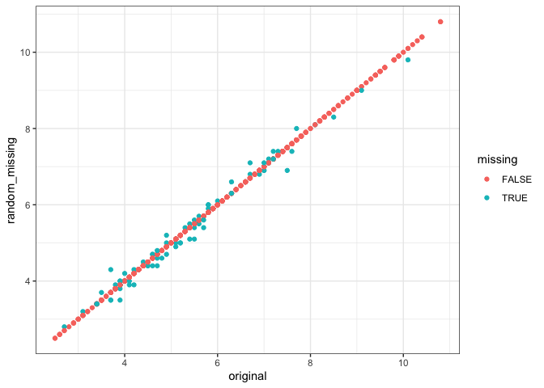
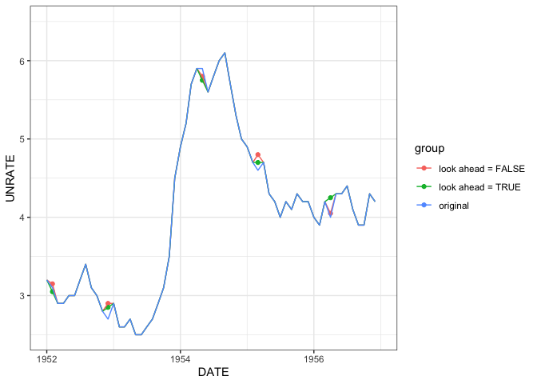
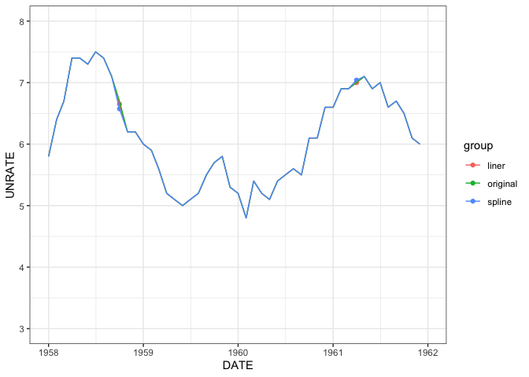
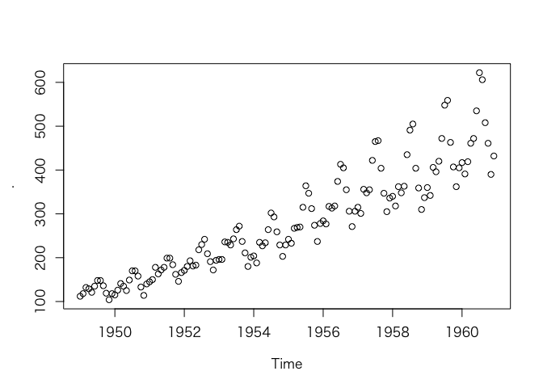
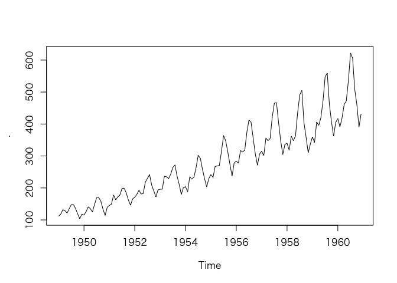
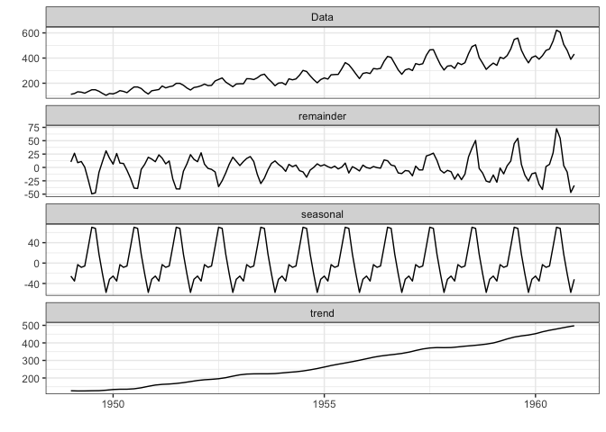

2章 時系列データの見つけ方と前処理
================
@nozma
2022-08-17

``` r
knitr::opts_chunk$set(warning = FALSE)

library(readr)
library(dplyr)
library(tidyr)
library(lubridate)
library(purrr)
library(ggplot2)
theme_set(theme_bw())
library(zoo)
library(imputeTS)
library(reticulate)
library(ggfortify)
```

## 2.2 表データの集合から時系列データの集合を作成する

-   書籍のGitHubリポジトリからデータ読み込み。
-   以下の調整を行った。
    -   `user`、`emailsOpens`は整数型に変換。
    -   `week`は日付型に変換。

``` r
yearJoined <- read_csv(
  "https://raw.githubusercontent.com/PracticalTimeSeriesAnalysis/BookRepo/master/Ch02/data/year_joined.csv",
  col_types = "ici"
)
emails <- read_csv(
  "https://raw.githubusercontent.com/PracticalTimeSeriesAnalysis/BookRepo/master/Ch02/data/emails.csv",
  col_types = "nnT"
) %>% 
  mutate(
    emailsOpened = as.integer(emailsOpened),
    user = as.integer(user),
    week = as.Date(week)
  )
donations <- read_csv(
  "https://raw.githubusercontent.com/PracticalTimeSeriesAnalysis/BookRepo/master/Ch02/data/donations.csv",
  col_types = "nTn"
) %>% mutate(user = as.integer(user))
```

### 2.2.1 事例：収集した時系列データを組み立てる

#### p.25 `yearJoined`のレコードが会員毎に何件あるかを確認する

``` r
yearJoined %>% count(user) %>% distinct(n)
```

    ## # A tibble: 1 × 1
    ##       n
    ##   <int>
    ## 1     1

#### p.26 ユーザーがメールを開いていない週のレコードが存在するかどうかを確認する

まず、0件のデータがないことを確認。

``` r
emails %>% filter(emailsOpened < 1)
```

    ## # A tibble: 0 × 3
    ## # … with 3 variables: emailsOpened <int>, user <int>, week <date>
    ## # ℹ Use `colnames()` to see all variable names

次に特定のユーザーのデータを見て、欠損があることを確認。

-   書籍では生のデータを確認していたが、日付の差分をとり間隔が7日ではないデータが存在することを確認した。
-   日付の範囲から期待されるレコード数を求める方法は直感的ではなく間違いにつながる可能性(※)があるため略。
    -   ※意図しないレコードが挿入されていたり、レコードが重複しているような場合を発見できない可能性がある。

``` r
emails %>% 
  filter(user == 998) %>% 
  arrange(week) %>% 
  mutate(diff = week - lag(week)) %>% 
  count(diff)
```

    ## # A tibble: 3 × 2
    ##   diff        n
    ##   <drtn>  <int>
    ## 1  7 days    21
    ## 2 14 days     2
    ## 3 NA days     1

#### p.27 会員データの欠損週を埋める

書籍では日付とユーザーIDの直積を求め、それをインデックスに設定する形で欠損週のデータを生成している。

しかし、これには次のような課題がある。

-   すべてのユーザーがメールを開かなかった週が存在する場合、その週は欠損したままである。
-   ユーザーごとに先頭・末尾に不要なレコードが生ずるため、処理が手間である。
    -   書籍では、これを後の作業で取り除いている。

そこで、次のように行った。

-   ユーザーごとに`week`の最大・最小を求める。
-   `purrr::map2`で1週間ごとの日付を生成し、`tidyr::unnest`で展開。
-   元のデータを再度結合し、`tidyr::replace_na`でNAを0に置換。

``` r
emails %>% 
  group_by(user) %>% 
  # ユーザーごとに最大・最小の日付を取得
  summarise(
    start_date = min(week), 
    end_date = max(week)
  ) %>% 
  # 最大・最小の範囲から1週間ごとの日付を生成
  mutate(
    week = map2(start_date, end_date, ~seq(.x, .y, by = "1 week"))
  ) %>% 
  unnest(week) %>% 
  select(user, week) %>% 
  # emailsデータを結合してNAを0で置換
  left_join(emails, by = c("user", "week")) %>% 
  replace_na(list(emailsOpened = 0)) -> all_email
```

### 2.2.2 発掘した時系列の構築

#### p.30 寄付額データを1週間単位に変換

`lubridate::round_date`でタイムスタンプを1週間単位にしてから集約。

``` r
donations %>% 
  mutate(
    week = ceiling_date(timestamp, unit = "week", week_start = 1)
  ) %>% 
  group_by(user, week) %>% 
  summarise(
    amount = sum(amount),
    .groups = "drop"
  ) -> agg_donations
```

#### p.30-31 メール開封データと寄付額データを結合する

書籍のPythonコードはかなり修正しないと動かなかった。

p.31でターゲット変数のシフトも行っているので、それもついでに実施する。

``` r
all_email %>% 
  left_join(agg_donations, by = c("user", "week")) %>% 
  group_by(user) %>% 
  mutate(
    target = lag(amount)
  ) %>% 
  replace_na(list(amount = 0, target = 0)) -> merged_df
```

``` r
merged_df %>% 
  filter(user == 998)
```

    ## # A tibble: 26 × 5
    ## # Groups:   user [1]
    ##     user week                emailsOpened amount target
    ##    <int> <dttm>                     <int>  <dbl>  <dbl>
    ##  1   998 2017-12-04 00:00:00            1      0      0
    ##  2   998 2017-12-11 00:00:00            3      0      0
    ##  3   998 2017-12-18 00:00:00            3      0      0
    ##  4   998 2017-12-25 00:00:00            0      0      0
    ##  5   998 2018-01-01 00:00:00            3      0      0
    ##  6   998 2018-01-08 00:00:00            3     50      0
    ##  7   998 2018-01-15 00:00:00            2      0     50
    ##  8   998 2018-01-22 00:00:00            3      0      0
    ##  9   998 2018-01-29 00:00:00            2      0      0
    ## 10   998 2018-02-05 00:00:00            3      0      0
    ## # … with 16 more rows
    ## # ℹ Use `print(n = ...)` to see more rows

## 2.4 データのクリーニング

### 2.4.1 欠損値の処理

#### p.38 データの準備

もともとRのコードだが、本文のコードは下から2行目が誤っている。

-   誤: `high.unemp.idx <- sample(high.unemp.idx,)`
-   正: `high.unemp.idx <- sample(high.unemp.idx, num.to.select)`

その他の記述もやや冗長なので書き直した。

``` r
unemp <- read_csv(
  "https://raw.githubusercontent.com/PracticalTimeSeriesAnalysis/BookRepo/master/Ch02/data/UNRATE.csv",
  col_types = "Dn"
)

# 無作為に欠損させたデータセットを生成する
set.seed(778)
unemp %>% 
  slice_sample(prop = 0.9) -> rand_unemp

# 失業率が高い月に欠損している確率が高いデータセットを生成する
unemp %>% 
  anti_join(
    # 失業率8を超えるレコードの20%を抽出し、anti_joinで除外
    unemp %>% filter(UNRATE > 8) %>% slice_sample(prop = 0.2),
    by = c("DATE", "UNRATE")
  ) -> bias_unemp
```

#### p.40 欠損させたデータの日付とNAを補う

書籍ではrolling
joinを使用しているが、使わなくとも可能かつ現行バージョンのdplyrではrolling
joinができないので別の方法で埋める。

``` r
all_dates <- seq(min(unemp$DATE), max(unemp$DATE), by = "1 month")
tibble(DATE = all_dates) %>% 
  left_join(rand_unemp, by = "DATE") %>% 
  mutate(missing = is.na(UNRATE)) -> rand_unemp
tibble(DATE = all_dates) %>% 
  left_join(bias_unemp, by = "DATE") %>% 
  mutate(missing = is.na(UNRATE)) -> bias_unemp
```

#### p.41-42 前方埋め

前方埋めをした上でp.41の作図まで行う。

``` r
unemp %>% 
  mutate(group = "original") %>% 
  union_all(
    rand_unemp %>% 
      fill(UNRATE, .direction = "down") %>% # 前方埋め
      mutate(group = "random missing")
  ) %>% 
  ggplot(aes(x = DATE, y = UNRATE, color = group)) +
  geom_line() +
  geom_point(data = . %>% filter(missing)) +
  lims(x = c(ymd("1977/01/01"), ymd("1981/12/31")))
```

<!-- -->

p.42の作図

``` r
unemp %>% 
  rename(original = UNRATE) %>% 
  left_join(
    rand_unemp %>% 
      fill(UNRATE, .direction = "down") %>% # 前方埋め
      rename(random_missing = UNRATE),
    by = "DATE"
  ) %>% 
  ggplot(aes(x = original, y = random_missing, color = missing)) +
  geom_point()
```

<!-- -->

#### p.44 移動平均

先読みをしない移動平均による補完。先読みをしない移動平均は`zoo::rollmean()`で`align = "right"`を指定するか、`zoo::rollmeanr()`を使う。

ただし、この方法では移動平均の範囲を上回って連続するNAが出現すると結果がNaNとなる。`imputeTS::na_ma()`ではそのような場合に移動平均の範囲を広げるアルゴリズムが採用されている。しかし、この関数は先読みなしの移動平均に対応していない。

``` r
rand_unemp %>% 
  mutate(
    rmean = rollmeanr(UNRATE, 3, fill = NA, na.rm = TRUE),
    UNRATE = if_else(missing, rmean, UNRATE)
  ) %>% 
  select(!rmean) -> smooth_1
smooth_1
```

    ## # A tibble: 844 × 3
    ##    DATE       UNRATE missing
    ##    <date>      <dbl> <lgl>  
    ##  1 1948-01-01   3.4  FALSE  
    ##  2 1948-02-01   3.8  FALSE  
    ##  3 1948-03-01   4    FALSE  
    ##  4 1948-04-01   3.9  TRUE   
    ##  5 1948-05-01   3.5  FALSE  
    ##  6 1948-06-01   3.6  FALSE  
    ##  7 1948-07-01   3.6  FALSE  
    ##  8 1948-08-01   3.9  FALSE  
    ##  9 1948-09-01   3.75 TRUE   
    ## 10 1948-10-01   3.7  FALSE  
    ## # … with 834 more rows
    ## # ℹ Use `print(n = ...)` to see more rows

``` r
# bias_unempは略
```

先読みをする移動平均。

``` r
rand_unemp %>% 
  mutate(
    rmean = rollmean(UNRATE, 3, fill = NA, na.rm = TRUE),
    UNRATE = if_else(missing, rmean, UNRATE)
  ) %>% 
  select(!rmean) -> smooth_2
smooth_2
```

    ## # A tibble: 844 × 3
    ##    DATE       UNRATE missing
    ##    <date>      <dbl> <lgl>  
    ##  1 1948-01-01   3.4  FALSE  
    ##  2 1948-02-01   3.8  FALSE  
    ##  3 1948-03-01   4    FALSE  
    ##  4 1948-04-01   3.75 TRUE   
    ##  5 1948-05-01   3.5  FALSE  
    ##  6 1948-06-01   3.6  FALSE  
    ##  7 1948-07-01   3.6  FALSE  
    ##  8 1948-08-01   3.9  FALSE  
    ##  9 1948-09-01   3.8  TRUE   
    ## 10 1948-10-01   3.7  FALSE  
    ## # … with 834 more rows
    ## # ℹ Use `print(n = ...)` to see more rows

p.45の作図。

``` r
unemp %>% mutate(group = "original") %>% 
  union_all(smooth_1 %>% mutate(group = "look ahead = FALSE")) %>% 
  union_all(smooth_2 %>% mutate(group = "look ahead = TRUE")) %>% 
  ggplot(aes(x = DATE, y = UNRATE, color = group)) +
  geom_point(data = . %>% filter(missing)) +
  lims(x = c(ymd("1952/01/01"), ymd("1956/12/31")), y = c(2.5, 6.5)) +
  geom_line()
```

<!-- -->

#### p.46 補間

線形補間と多項式補間。`imputeTS::na_interpolation()`を使った。

``` r
unemp %>% mutate(group = "original") %>% 
  union_all(
    rand_unemp %>% 
      mutate(
        group = "liner",
        UNRATE = na_interpolation(UNRATE) # 線形補間
      )
  ) %>% 
  union_all(
    rand_unemp %>% 
      mutate(
        group = "spline",
        UNRATE = na_interpolation(UNRATE, option = "spline") # 多項式(スプライン)補完
      )
  ) %>% 
  ggplot(aes(x = DATE, y = UNRATE, color = group)) +
  geom_point(data = . %>% filter(missing)) +
  lims(x = c(ymd("1958/01/01"), ymd("1961/12/31")), y = c(3, 8)) +
  geom_line()
```

<!-- -->

#### p.47 全体的な比較

各種の補完手法に対し、平均二乗誤差を計算する。

``` r
calc_mse <- function(target) {
  unemp %>% 
    mutate(
      # 前方埋め
      inpute_ff = target %>%
        fill(UNRATE, .direction = "down") %>% 
        pull(UNRATE), 
      # 移動平均(先読みなし)
      inpute_rm_nolookahead = target %>% 
        mutate(
          rmean = rollmeanr(UNRATE, 3, fill = NA, na.rm = TRUE),
          UNRATE = if_else(missing, rmean, UNRATE)
        ) %>% 
        pull(UNRATE),
      # 移動平均(先読みあり)
      inpute_rm_lookahead = target %>% 
        mutate(
          rmean = rollmean(UNRATE, 3, fill = NA, na.rm = TRUE),
          UNRATE = if_else(missing, rmean, UNRATE)
        ) %>% 
        pull(UNRATE),
      # 線形補間
      inpute_li = target %>% 
        mutate(
          group = "liner",
          UNRATE = na_interpolation(UNRATE)
        ) %>% 
        pull(UNRATE),
      # 多項式補間
      inpute_sp = target %>% 
        mutate(
          group = "spline",
          UNRATE = na_interpolation(UNRATE)
        ) %>% 
        pull(UNRATE),
    ) %>% 
    summarise_at(vars(starts_with("inpute")), ~mean((.x - UNRATE)^2, na.rm = TRUE))
}
```

``` r
calc_mse(rand_unemp)
```

    ## # A tibble: 1 × 5
    ##   inpute_ff inpute_rm_nolookahead inpute_rm_lookahead inpute_li inpute_sp
    ##       <dbl>                 <dbl>               <dbl>     <dbl>     <dbl>
    ## 1   0.00344               0.00466             0.00180   0.00140   0.00140

``` r
calc_mse(bias_unemp)
```

    ## # A tibble: 1 × 5
    ##   inpute_ff inpute_rm_nolookahead inpute_rm_lookahead inpute_li inpute_sp
    ##       <dbl>                 <dbl>               <dbl>     <dbl>     <dbl>
    ## 1   0.00143               0.00161            0.000504  0.000375  0.000375

### 2.4.2 アップサンプリングとダウンサンプリング

#### p.49 `unemp`から1月のデータのみ抜き出す。

``` r
unemp %>% 
  filter(month(DATE) == 1)
```

    ## # A tibble: 71 × 2
    ##    DATE       UNRATE
    ##    <date>      <dbl>
    ##  1 1948-01-01    3.4
    ##  2 1949-01-01    4.3
    ##  3 1950-01-01    6.5
    ##  4 1951-01-01    3.7
    ##  5 1952-01-01    3.2
    ##  6 1953-01-01    2.9
    ##  7 1954-01-01    4.9
    ##  8 1955-01-01    4.9
    ##  9 1956-01-01    4  
    ## 10 1957-01-01    4.2
    ## # … with 61 more rows
    ## # ℹ Use `print(n = ...)` to see more rows

#### p.49 年単位の平均をとる

``` r
unemp %>% group_by(year(DATE)) %>% summarise(mean(UNRATE))
```

    ## # A tibble: 71 × 2
    ##    `year(DATE)` `mean(UNRATE)`
    ##           <dbl>          <dbl>
    ##  1         1948           3.75
    ##  2         1949           6.05
    ##  3         1950           5.21
    ##  4         1951           3.28
    ##  5         1952           3.02
    ##  6         1953           2.92
    ##  7         1954           5.59
    ##  8         1955           4.37
    ##  9         1956           4.12
    ## 10         1957           4.3 
    ## # … with 61 more rows
    ## # ℹ Use `print(n = ...)` to see more rows

#### p.50 不規則な時系列をアップサンプリングする

``` r
# p.40と同じ内容のため略
```

#### p.51 月初の値で月内の値を補う

月初から月末までの日付を生成して`unnest`。

``` r
unemp %>% 
  mutate(
    DATE = map(DATE, ~seq(.x, .x + months(1) - days(1), by = "day"))
  ) %>% 
  unnest(DATE)
```

    ## # A tibble: 25,688 × 2
    ##    DATE       UNRATE
    ##    <date>      <dbl>
    ##  1 1948-01-01    3.4
    ##  2 1948-01-02    3.4
    ##  3 1948-01-03    3.4
    ##  4 1948-01-04    3.4
    ##  5 1948-01-05    3.4
    ##  6 1948-01-06    3.4
    ##  7 1948-01-07    3.4
    ##  8 1948-01-08    3.4
    ##  9 1948-01-09    3.4
    ## 10 1948-01-10    3.4
    ## # … with 25,678 more rows
    ## # ℹ Use `print(n = ...)` to see more rows

### 2.4.3 データの平滑化

#### p.54 指数平滑法

例示されている航空旅客データはRだと標準パッケージの`datasets`に含まれている`AirPassengers`が該当する。

``` r
AirPassengers
```

    ##      Jan Feb Mar Apr May Jun Jul Aug Sep Oct Nov Dec
    ## 1949 112 118 132 129 121 135 148 148 136 119 104 118
    ## 1950 115 126 141 135 125 149 170 170 158 133 114 140
    ## 1951 145 150 178 163 172 178 199 199 184 162 146 166
    ## 1952 171 180 193 181 183 218 230 242 209 191 172 194
    ## 1953 196 196 236 235 229 243 264 272 237 211 180 201
    ## 1954 204 188 235 227 234 264 302 293 259 229 203 229
    ## 1955 242 233 267 269 270 315 364 347 312 274 237 278
    ## 1956 284 277 317 313 318 374 413 405 355 306 271 306
    ## 1957 315 301 356 348 355 422 465 467 404 347 305 336
    ## 1958 340 318 362 348 363 435 491 505 404 359 310 337
    ## 1959 360 342 406 396 420 472 548 559 463 407 362 405
    ## 1960 417 391 419 461 472 535 622 606 508 461 390 432

pandasのpandas.DataFrame.ewmの`adjust=True`と同等の機能を持った関数を定義

``` r
my_ewm <- function(x, a = NULL, adjust = TRUE) {
  nx <- length(x)
  if(is.null(a)) a = 2 / (nx + 1)
  y <- numeric(nx)
  y[1] <- x[1]
  if(adjust){
    a_adj <- 1
    w_sum <- x[1]
  }
  for (k in 2:nx) {
    if(adjust) {
      a_adj <- a_adj + (1 - a)^(k - 1)
      w_sum <- (x[k] + (1 - a) * w_sum)
      y[k] <-  w_sum / a_adj
    } else {
      y[k] <- a * x[k] + (1 - a) * y[k - 1]
    }
  }
  return(y)
}
```

pandasのewmをreticulateを使って呼び出し、自作の平滑化関数を比較し、結果が一致することを確認。

``` r
pd <- import("pandas")

data.frame(
  Passengers = AirPassengers,
  my_ewm_5 = my_ewm(AirPassengers, 0.5),
  pd_ewm_5 = pd$DataFrame$ewm(
    data.frame(AirPassengers), 
    alpha = 0.5)$mean() %>% pull,
  my_ewm_9 = my_ewm(AirPassengers, 0.9),
  pd_ewm_9 = pd$DataFrame$ewm(
    data.frame(AirPassengers), 
    alpha = 0.9)$mean() %>% pull
  ) %>% head()
```

    ##   Passengers my_ewm_5 pd_ewm_5 my_ewm_9 pd_ewm_9
    ## 1        112 112.0000 112.0000 112.0000 112.0000
    ## 2        118 116.0000 116.0000 117.4545 117.4545
    ## 3        132 125.1429 125.1429 130.5586 130.5586
    ## 4        129 127.2000 127.2000 129.1557 129.1557
    ## 5        121 124.0000 124.0000 121.8155 121.8155
    ## 6        135 129.5873 129.5873 133.6816 133.6816

## 2.5 季節性データ

#### p.57のグラフ

``` r
AirPassengers %>% plot(type = "p")
```

<!-- -->

``` r
AirPassengers %>% plot()
```

<!-- -->

#### p.58のグラフ

``` r
plot(stl(AirPassengers, "periodic"))
```

<!-- -->

`ggfortify`を使う場合。

``` r
autoplot(stl(AirPassengers, "periodic"))
```

<!-- -->

## 2.6 タイムゾーン

#### p.60

参考: [A Tour of Timezones (& Troubles) in R \|
R-bloggers](https://www.r-bloggers.com/2018/07/a-tour-of-timezones-troubles-in-r/)

`as.POSIXct()`はタイムゾーンを指定しないと、ローカルのタイムゾーンが自動で適用される。実行環境に依存するので割と危ない。

``` r
x <- "2022-01-01 12:00:00"
as.POSIXct(x)
```

    ## [1] "2022-01-01 12:00:00 JST"

``` r
Sys.timezone()
```

    ## [1] "Asia/Tokyo"

``` r
as.POSIXct(x, tz = "America/Chicago")
```

    ## [1] "2022-01-01 12:00:00 CST"

`as.POSIXct()`でPOSIXctオブジェクトを作成した場合、`tz =`でタイムゾーンを指定しても時計の時刻は同じ。

``` r
as.POSIXct(x, tz = "America/Chicago") - as.POSIXct(x)
```

    ## Time difference of 15 hours

`tz =`が不正なものである場合はGMT(UTC)で返る。以前は警告が出なかったらしいが今は出る。

``` r
as.POSIXct(x, tz = "America/Ypsilanti")
```

    ## Warning in strptime(xx, f, tz = tz): unknown timezone 'America/Ypsilanti'

    ## Warning in as.POSIXct.POSIXlt(x): unknown timezone 'America/Ypsilanti'

    ## Warning in strptime(x, f, tz = tz): unknown timezone 'America/Ypsilanti'

    ## Warning in as.POSIXct.POSIXlt(as.POSIXlt(x, tz, ...), tz, ...): unknown timezone
    ## 'America/Ypsilanti'

    ## Warning in as.POSIXlt.POSIXct(x, tz): unknown timezone 'America/Ypsilanti'

    ## [1] "2022-01-01 12:00:00 GMT"

有効な名前は`OlsonName()`で一覧を得られるので、有効かどうかの判定はできる。

``` r
c("America/Chicago", "America/Detroit", "America/Ypsilanti") %in% OlsonNames()
```

    ## [1]  TRUE  TRUE FALSE

`lubridate`を使う場合。

`lubridate::as_datetime()`はデフォルトでUTCを返すので、実行環境によりタイムゾーンが意図せず変わる心配をしなくて良い。

``` r
as_datetime(x)
```

    ## [1] "2022-01-01 12:00:00 UTC"

生成されるオブジェクトはPOSIXctであるため、他のパッケージの関数に渡すような場合でも問題はない。

``` r
as_datetime(x) %>% class()
```

    ## [1] "POSIXct" "POSIXt"

タイムゾーンの指定も可。

``` r
as_datetime(x, tz = "Asia/Tokyo")
```

    ## [1] "2022-01-01 12:00:00 JST"

正しくないタイムゾーンの名前を指定した場合、警告ではなくエラーが出るのでこの点も安心。

``` r
as_datetime(x, tz = "Asia/Tokyu")
```

    ## Error: CCTZ: Unrecognized output timezone: "Asia/Tokyu"

``` r
# サンプルデータ生成
tbl <- tibble(datetime = ymd_hm("2018-03-10 23:30") + hours(c(1, 2, 4, 5, 6)))
```

``` r
tz(tbl$datetime)
```

    ## [1] "UTC"

`lubridate::force_tz()`は表示されている時刻は変更せずにタイムゾーンを変更する(つまりclock
timeが維持されて、UTCとしての時刻は変わる)。

``` r
tbl %>% 
  mutate(datetime = force_tz(datetime, "America/New_York")) -> tbl
tbl
```

    ## # A tibble: 5 × 1
    ##   datetime           
    ##   <dttm>             
    ## 1 2018-03-11 00:30:00
    ## 2 2018-03-11 01:30:00
    ## 3 2018-03-11 03:30:00
    ## 4 2018-03-11 04:30:00
    ## 5 2018-03-11 05:30:00

``` r
tz(tbl$datetime)
```

    ## [1] "America/New_York"

``` r
diff(tbl$datetime)
```

    ## Time differences in hours
    ## [1] 1 1 1 1

`lubridate::with_tz()`はUTCとしての時刻が維持されて、表示上の時刻であるclock
timeを変更してタイムゾーンを変更する。

``` r
tbl %>% 
  mutate(datetime = with_tz(datetime, "Asia/Tokyo")) -> tbl
tbl
```

    ## # A tibble: 5 × 1
    ##   datetime           
    ##   <dttm>             
    ## 1 2018-03-11 14:30:00
    ## 2 2018-03-11 15:30:00
    ## 3 2018-03-11 16:30:00
    ## 4 2018-03-11 17:30:00
    ## 5 2018-03-11 18:30:00

``` r
tz(tbl$datetime)
```

    ## [1] "Asia/Tokyo"
