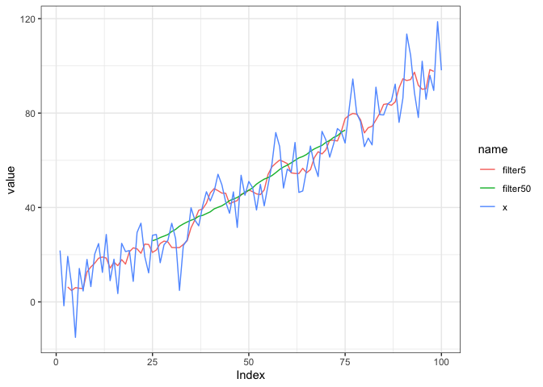
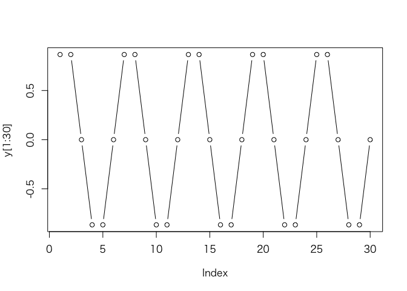
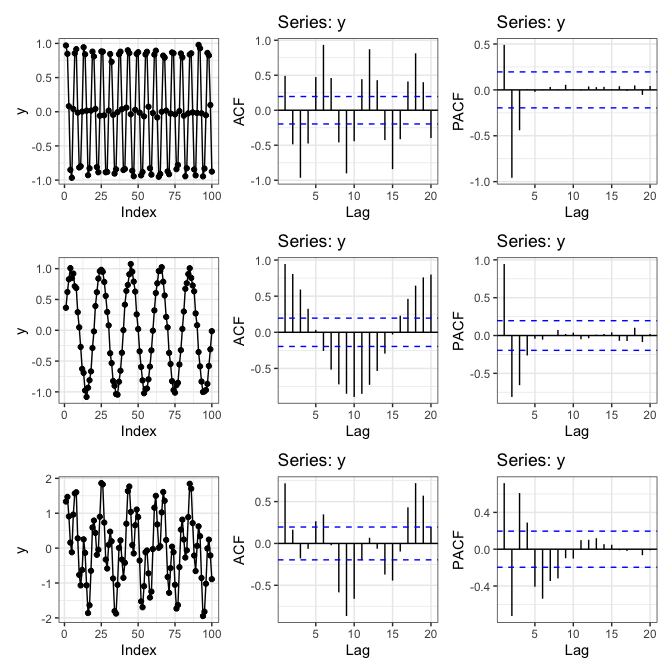
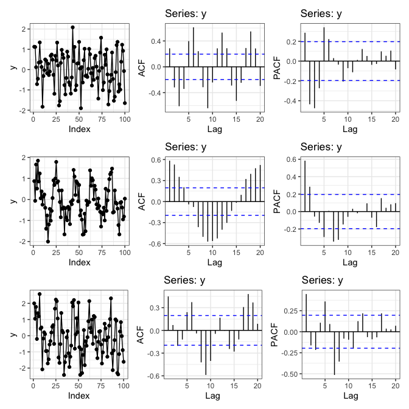

3章 時系列の探索的データ解析
================
@nozma
2022-09-01

``` r
knitr::opts_chunk$set(warning = FALSE)
library(dplyr)
library(ggplot2)
theme_set(theme_bw())
library(lubridate)
library(tidyr)
library(forcats)
library(patchwork)
library(zoo)
library(forecast)
```

## 3.1 よく使用される手法

### 3.1.1 プロット

#### p.70-71

``` r
EuStockMarkets %>% head()
```

    ## Time Series:
    ## Start = c(1991, 130) 
    ## End = c(1991, 135) 
    ## Frequency = 260 
    ##              DAX    SMI    CAC   FTSE
    ## 1991.496 1628.75 1678.1 1772.8 2443.6
    ## 1991.500 1613.63 1688.5 1750.5 2460.2
    ## 1991.504 1606.51 1678.6 1718.0 2448.2
    ## 1991.508 1621.04 1684.1 1708.1 2470.4
    ## 1991.512 1618.16 1686.6 1723.1 2484.7
    ## 1991.515 1610.61 1671.6 1714.3 2466.8

``` r
plot(EuStockMarkets)
```

<!-- -->

#### p.72

``` r
frequency(EuStockMarkets)
```

    ## [1] 260

``` r
start(EuStockMarkets)
```

    ## [1] 1991  130

``` r
end(EuStockMarkets)
```

    ## [1] 1998  169

``` r
window(EuStockMarkets, start = 1997, end = 1998) %>% head()
```

    ## Time Series:
    ## Start = c(1997, 1) 
    ## End = c(1997, 6) 
    ## Frequency = 260 
    ##              DAX    SMI    CAC   FTSE
    ## 1997.000 2844.09 3869.8 2289.6 4092.5
    ## 1997.004 2844.09 3869.8 2289.6 4092.5
    ## 1997.008 2844.09 3869.8 2303.8 4092.5
    ## 1997.012 2859.22 3922.2 2307.0 4091.0
    ## 1997.015 2880.07 3948.3 2318.6 4115.7
    ## 1997.019 2880.07 3942.2 2315.7 4118.5

データフレームにする場合、`time()`で抽出したタイムスタンプに`lubiridate::date_decimal()`を使うとPOSIXctでの表現を得られる。

``` r
EuStockMarkets %>% 
  as_tibble() %>% 
  mutate(Time = time(EuStockMarkets) %>% as.numeric() %>% date_decimal()) -> df
df
```

    ## # A tibble: 1,860 × 5
    ##      DAX   SMI   CAC  FTSE Time               
    ##    <dbl> <dbl> <dbl> <dbl> <dttm>             
    ##  1 1629. 1678. 1773. 2444. 1991-07-01 02:18:27
    ##  2 1614. 1688. 1750. 2460. 1991-07-02 12:00:00
    ##  3 1607. 1679. 1718  2448. 1991-07-03 21:41:32
    ##  4 1621. 1684. 1708. 2470. 1991-07-05 07:23:04
    ##  5 1618. 1687. 1723. 2485. 1991-07-06 17:04:36
    ##  6 1611. 1672. 1714. 2467. 1991-07-08 02:46:09
    ##  7 1631. 1683. 1734. 2488. 1991-07-09 12:27:41
    ##  8 1640. 1704. 1757. 2508. 1991-07-10 22:09:13
    ##  9 1635. 1698. 1754  2510. 1991-07-12 07:50:46
    ## 10 1646. 1716. 1754. 2497. 1991-07-13 17:32:18
    ## # … with 1,850 more rows

`ggplot2`でのプロット。

``` r
df %>% 
  pivot_longer(cols = DAX:FTSE) %>% 
  mutate(name = fct_inorder(name)) -> #順序調整
  df_longer
df_longer %>% 
  ggplot(aes(x = Time, y = value)) +
  geom_line() +
  facet_grid(name ~ .)
```

<!-- -->

要約。

``` r
df %>% 
  mutate(Year = year(Time)) %>% 
  count(Year)
```

    ## # A tibble: 8 × 2
    ##    Year     n
    ##   <dbl> <int>
    ## 1  1991   131
    ## 2  1992   260
    ## 3  1993   260
    ## 4  1994   260
    ## 5  1995   260
    ## 6  1996   260
    ## 7  1997   260
    ## 8  1998   169

``` r
df %>% 
  summarise(
    start = min(Time),
    end = max(Time)
  )
```

    ## # A tibble: 1 × 2
    ##   start               end                
    ##   <dttm>              <dttm>             
    ## 1 1991-07-01 02:18:27 1998-08-24 20:18:27

抽出。`window()`とは結果が若干異なる。`window(EuStockMarkets, start = 1997, end = 1998)`だと末尾は`1998.000`になり、1998年の最初のレコードが含まれるため。

``` r
df %>% 
  filter(Time >= "1997/01/01", Time < "1998/01/01")
```

    ## # A tibble: 260 × 5
    ##      DAX   SMI   CAC  FTSE Time               
    ##    <dbl> <dbl> <dbl> <dbl> <dttm>             
    ##  1 2844. 3870. 2290. 4092. 1997-01-01 00:00:00
    ##  2 2844. 3870. 2290. 4092. 1997-01-02 09:41:32
    ##  3 2844. 3870. 2304. 4092. 1997-01-03 19:23:04
    ##  4 2859. 3922. 2307  4091  1997-01-05 05:04:36
    ##  5 2880. 3948. 2319. 4116. 1997-01-06 14:46:09
    ##  6 2880. 3942. 2316. 4118. 1997-01-08 00:27:41
    ##  7 2880. 3942. 2316. 4118. 1997-01-09 10:09:13
    ##  8 2821. 3942. 2257  4057. 1997-01-10 19:50:46
    ##  9 2863. 3940. 2283. 4090. 1997-01-12 05:32:18
    ## 10 2890. 3924. 2307. 4106. 1997-01-13 15:13:50
    ## # … with 250 more rows

### 3.1.2 ヒストグラム

#### p.73

``` r
df_longer %>% 
  ggplot(aes(x = value)) +
  geom_histogram(bins = 30) +
  facet_grid(name ~ ., scales = "free_y")
```

<!-- -->

階差のヒストグラム。

``` r
df %>% 
  select(!Time) %>% 
  mutate_all(~.x - lag(.x)) %>% 
  na.omit() %>% 
  pivot_longer(cols = everything()) %>% 
  ggplot(aes(x = value)) +
  geom_histogram(bins = 30) +
  facet_grid(name ~ .)
```

<!-- -->

書籍のヒストグラムと結果が違うが、書籍のコードが誤っているのが原因。
ヒストグラムの`breaks`引数の値として`30`を渡すつもりのところ、括弧の位置が誤っていて`diff`の`lag`引数に`30`を渡してしまっており、`lag = 30`の階差のヒストグラムとなってしまっている。

-   誤: `hist(diff(EuStockMarkets[, "SMI"], 30))`
-   正: `hist(diff(EuStockMarkets[, "SMI"]), 30)`

### 3.1.3 散布図

#### p.74-45

``` r
df %>% 
  ggplot(aes(x = SMI, y = DAX)) +
  geom_point() -> p1
df %>% 
  select(!Time) %>% 
  mutate_all(~.x - lag(.x)) %>% 
  na.omit() %>% 
  ggplot(aes(x = SMI, y = DAX)) +
  geom_point() +
  labs(x = "diff(SMI)", y = "diff(DAX)") -> p2

p1 / p2
```

<!-- -->

#### p.75-76

「一つ前にシフト」は`dplyr::lead`で行う。

``` r
df %>% 
  mutate(
    SMI = lead(SMI - lag(SMI)),
    DAX = DAX - lag(DAX)
  ) %>% 
  ggplot(aes(x = SMI, y = DAX)) +
  geom_point()
```

<!-- -->

## 3.2 時系列専用の探索手法

### 3.2.2 ウィンドウ関数の適用

#### p.81 ローリングウィンドウ

``` r
set.seed(778)

x <- rnorm(n = 100, mean = 0, sd = 10) + 1:100
mn <- function(n) rep(1/n, n)

tibble(x) %>% 
  mutate(
    filter5 = stats::filter(x, mn(5)),
    filter50 = stats::filter(x, mn(50)),
    Index = row_number()
  ) %>% 
  pivot_longer(cols = 1:3) %>% 
  ggplot(aes(x = Index, y = value, col = name)) +
  geom_line()
```

<!-- -->

#### p.82 rollapply

`zoo`の`numeric`への変換が必要。

``` r
f1 <- rollapply(zoo(x), 20, function(w) min(w), align = "left", partial = TRUE)
f2 <- rollapply(zoo(x), 20, function(w) min(w), align = "right", partial = TRUE)

tibble(x) %>% 
  mutate(f1, f2, Index = row_number()) %>% 
  pivot_longer(cols = 1:3, values_transform = as.numeric) %>% 
  ggplot(aes(x = Index, y = value, col = name)) +
  geom_line()
```

<!-- -->

#### p.84 拡張ウィンドウを利用した最大と平均の計算

`cummean()`は`dplyr`パッケージに実装がある。

``` r
tibble(x) %>% 
  mutate(
    cummax = cummax(x),
    cummean = cummean(x),
    Index = row_number()
  ) %>% 
  pivot_longer(cols = 1:3) %>% 
  ggplot(aes(x = Index, y = value, col = name)) +
  geom_line()
```

<!-- -->

### 3.2.3 自己相関の理解と識別方法

#### p.86 自己相関

``` r
x <- 1:100
y <- sin(x * pi / 3)
plot(y[1:30], type = "b")
```

<!-- -->

`stats::acf()`を使う方法

書籍のプロットを再現するには、`lag.max = 30`と`ci = 0.5`あたりを指定する必要があるように思われる。後の図でも書籍の棄却域は狭い。

``` r
acf(y, lag.max = 30)
```

<!-- -->

`forecast::ggAcf()`を使えば`ggplot2`でACFのプロットを作成できる。

``` r
ggAcf(y)
```

<!-- -->

自己相関係数を自分で計算する。

`data.table::shift()`と同じことは`dplyr::lag()`でもできる。

``` r
cor(y, lag(y), use = "complete.obs")
```

    ## [1] 0.5001531

``` r
cor(y, lag(y, 2), use = "complete.obs")
```

    ## [1] -0.5037152

#### p.89 偏自己相関関数

``` r
ggPacf(y, lag.max = 30)
```

<!-- -->

#### p.90 ACFとPACFのプロット

``` r
y1 <- sin(x * pi / 3)
y2 <- sin(x * pi / 10)

tibble(y1, Index = seq_along(y1)) %>% 
  ggplot(aes(x = Index, y = y1)) +
  geom_line() + geom_point() -> p_y1
ggAcf(y1) -> acf_y1
ggPacf(y1) -> pacf_y1

tibble(y2, Index = seq_along(y2)) %>% 
  ggplot(aes(x = Index, y = y2)) +
  geom_line() + geom_point() -> p_y2
ggAcf(y2) -> acf_y2
ggPacf(y2) -> pacf_y2
```

y1 + y2の系列を作成し、比較用のプロットを作成する。

``` r
y <- y1 + y2

tibble(y, Index = seq_along(y)) %>% 
  ggplot(aes(x = Index, y = y)) +
  geom_line() + geom_point() -> p_y
ggAcf(y) -> acf_y
ggPacf(y) -> pacf_y

(p_y1 + acf_y1 + pacf_y1) /
(p_y2 + acf_y2 + pacf_y2) / 
(p_y + acf_y + pacf_y)
```

<!-- -->

データにノイズを増やす。

``` r
set.seed(778)
noise1 <- rnorm(100, sd = 0.05)
noise2 <- rnorm(100, sd = 0.05)

fp <- function(y) {
  tibble(y, Index = seq_along(y)) %>% 
    ggplot(aes(x = Index, y = y)) +
    geom_line() + geom_point() -> p1
  ggAcf(y) -> p2
  ggPacf(y) -> p3
  p1 + p2 + p3
}

fp(y1 + noise1) / fp(y2 + noise2) / fp(y1 + y2 + noise1 + noise2)
```

<!-- -->

ノイズを大きくする。

``` r
noise1 <- rnorm(100, sd = 0.5)
noise2 <- rnorm(100, sd = 0.5)

fp(y1 + noise1) / fp(y2 + noise2) / fp(y1 + y2 + noise1 + noise2)
```

<!-- -->

#### p.94 非定常なデータ

書籍とはACFの結果が異なる。書籍と類似の結果はデータを`x <- 1:1000`などとすると得られる。

``` r
x <- 1:100
fp2 <- function(y) {
  tibble(y, Index = seq_along(y)) %>% 
    ggplot(aes(x = Index, y = y)) +
    geom_line() + geom_point() -> p1
  ggAcf(y) -> p2
  ggPacf(y) -> p3
  p1 / p2 / p3
}
fp2(x)
```

<!-- -->

#### p.95 AirPassengersのACF、PACFを求める

``` r
ggAcf(AirPassengers) / ggPacf(AirPassengers)
```

<!-- -->
